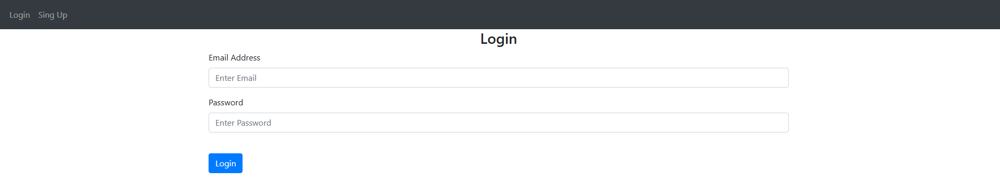
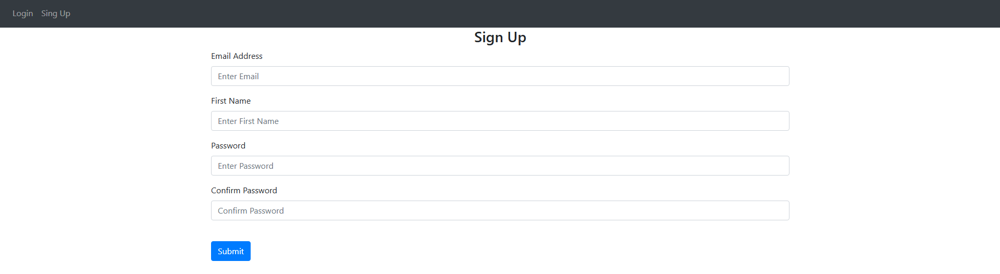
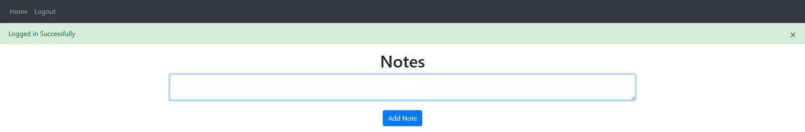
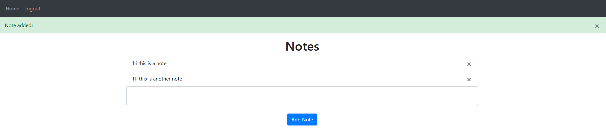

# Flask Notes App (Starter Template)

A simple and clean **Flask-based Notes Application** built to demonstrate:

- User authentication using Flask-Login  
- Basic CRUD operations (Create, Read, Delete notes)  
- Flash messaging for user feedback  
- SQLite database integration (with easy PostgreSQL upgrade)  

This project serves as a **beginner-friendly template** to understand how a full Flask application is structured.

---

## Features

- 🔐 User Signup & Login system  
- 📝 Create and delete notes  
- ⚡ Flash messages for errors and actions  
- 🗄️ SQLite database (default)  
- 🔄 Easily switchable to PostgreSQL  
- 🎨 Simple UI using Jinja, HTML, CSS, and JavaScript  

---

## Tech Stack

- **Backend:** Flask  
- **Frontend:** Jinja2, HTML, CSS, JavaScript  
- **Database:** SQLite (default)  
- **Authentication:** Flask-Login  

---

## 📷 Screenshots

### 🔑 Login Page


### 🆕 Signup Page


### 📝 Notes Dashboard


### + Adding Notes


---

## ⚙️ Installation & Setup

```bash
# Clone the repository
git clone https://github.com/murtazamoiz/flask-notes-app.git

# Navigate into the project
cd flask-notes-app

# Create virtual environment
python -m venv venv

# Activate environment
venv\Scripts\activate   # Windows
source venv/bin/activate # Mac/Linux

# Install dependencies from the root directory
pip install -r requirements.txt

# Run the app in the root directory
python main.py
